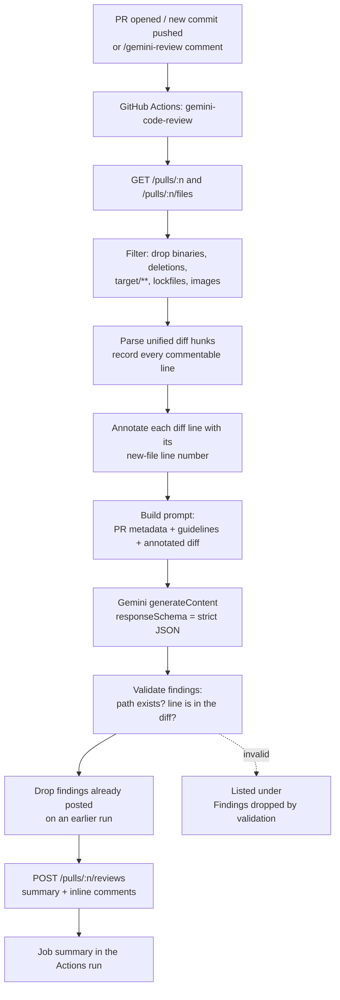

# Gemini Code Review PR Agent — Setup and Operations Guide

An AI code review agent that reads every pull request diff, reviews it with
**Google Gemini**, and posts the findings back to the PR as an inline GitHub
review.

- **Model provider:** Google Gemini (`generativelanguage.googleapis.com`, Google AI Studio key)
- **Runtime:** GitHub Actions, plain Node.js 20 — no npm dependencies to install or audit
- **Default posture:** advisory. It comments; it does not block merges until you opt in.

---

## 1. What was added

| File | Purpose |
| --- | --- |
| [`.github/workflows/gemini-code-review.yml`](../.github/workflows/gemini-code-review.yml) | GitHub Actions workflow — triggers, permissions, secrets, tuning knobs |
| [`.github/scripts/gemini-code-review.mjs`](../.github/scripts/gemini-code-review.mjs) | The agent: fetches the diff, calls Gemini, validates and publishes findings |
| [`.github/gemini-review-guidelines.md`](../.github/gemini-review-guidelines.md) | Project-specific review rules injected into the prompt |
| `docs/GEMINI_CODE_REVIEW_AGENT.md` | This guide |

Nothing in `src/`, `pom.xml`, or the existing `build-and-docker` workflow was
touched. The review agent runs as a separate, independent check.

---

## 2. How it works



Three design decisions worth knowing:

1. **Line numbers are pre-computed, not guessed.** The agent parses each hunk
   header and prints the real new-file line number next to every added and
   context line. Gemini cites those numbers, so inline comments land on the right
   line instead of being rejected by the GitHub API.
2. **Every finding is validated before it is posted.** A finding whose file is
   not in the diff, or whose line is not a commentable line, is dropped and
   listed in a collapsed section of the summary rather than silently discarded.
3. **Structured output, not prose parsing.** The Gemini call sets
   `responseMimeType: application/json` plus a `responseSchema`, so the model is
   constrained to return well-formed findings — no regex-scraping of markdown.

---

## 3. Step-by-step setup

### Step 1 — Get a Google Gemini API key

1. Open <https://aistudio.google.com/apikey>.
2. Sign in with your Google account.
3. Click **Create API key** and pick (or create) a Google Cloud project.
4. Copy the key — it looks like `AIza...`. You will not be able to view it again.

> Google AI Studio has a free tier with per-minute and per-day request limits
> that is enough for a low-traffic repository. Paid billing on the project raises
> the limits. See <https://ai.google.dev/pricing>.

### Step 2 — Add the key as a repository secret

**Via the GitHub UI**

1. Go to `https://github.com/vuppalapatisn/agent-orchestration`.
2. **Settings → Secrets and variables → Actions → Secrets** tab.
3. **New repository secret**.
4. Name: `GEMINI_API_KEY` — exactly this. Value: the `AIza...` key.
5. **Add secret**.

**Or via the GitHub CLI**

```bash
gh secret set GEMINI_API_KEY --repo vuppalapatisn/agent-orchestration
```

The command prompts for the value on stdin so the key never lands in your shell
history.

### Step 3 — Allow Actions to write to pull requests

The workflow already declares `permissions: pull-requests: write`, but the
repository setting must permit it:

1. **Settings → Actions → General**.
2. Under **Workflow permissions**, select **Read and write permissions**.
3. Tick **Allow GitHub Actions to create and approve pull requests**.
4. **Save**.

Without this, the review POST fails with `403 Resource not accessible by integration`.

### Step 4 — Merge the agent into your default branch

Workflows only trigger from the version that exists on the branch GitHub is
evaluating, so the agent must be on `main` before it reviews anything.

```bash
git checkout main
git merge claude/code-review-pr-agent-gemini-6f3571
git push origin main
```

Or open a PR from `claude/code-review-pr-agent-gemini-6f3571` into `main` and
merge it through the UI.

### Step 5 — Verify with a throwaway pull request

```bash
git checkout -b test/gemini-review-smoke
```

Add a deliberately flawed file to give the reviewer something real to find:

```bash
mkdir -p src/main/java/com/example/agentorchestration/tools
cat > src/main/java/com/example/agentorchestration/tools/SmokeTestTool.java <<'EOF'
package com.example.agentorchestration.tools;

import org.springframework.stereotype.Component;

@Component
public class SmokeTestTool {

    // Deliberate problems for the review agent to catch:
    private static final String API_KEY = "sk-live-abcdef123456";  // hardcoded secret
    private String lastCaller;                                      // mutable state on a singleton

    public String lookup(String id) {
        lastCaller = id;
        try {
            return API_KEY + id.trim().toUpperCase();                // NPE when id is null
        } catch (Exception e) {
            return null;                                             // swallowed exception
        }
    }
}
EOF
```

```bash
git add -A && git commit -m "test: smoke-test the Gemini review agent" && git push -u origin test/gemini-review-smoke
```

Then open the PR:

```bash
gh pr create --title "Smoke test: Gemini review agent" --body "Verifying the review agent." --base main
```

Within a minute or two you should see:

- A check named **gemini-code-review / review** in the PR's checks list.
- A PR review from `github-actions[bot]` with a `## 🤖 Gemini Code Review`
  summary comment.
- Inline comments on the flawed lines, tagged with severity and category, most
  with a one-click **Commit suggestion** block.

Delete the branch afterwards:

```bash
gh pr close test/gemini-review-smoke --delete-branch
```

### Step 6 — Tailor the review rules to your codebase

Edit [`.github/gemini-review-guidelines.md`](../.github/gemini-review-guidelines.md).
It is injected verbatim into the prompt and overrides the agent's built-in
defaults. It already carries this project's layer boundaries and Spring-specific
traps; add or remove rules as your standards change.

Keep it under roughly 200 lines. A long guidelines file dilutes attention and
degrades review quality.

---

## 4. Using the agent day to day

### Automatic runs

| Event | Behaviour |
| --- | --- |
| PR opened | Full review |
| New commit pushed to the PR | Re-review; findings already posted are not repeated |
| PR reopened | Full review |
| Draft PR marked ready | Full review |
| Draft PR | Skipped |
| PR from a fork | Skipped on push — see [Forked pull requests](#forked-pull-requests) |

### On-demand runs

Comment on any pull request:

```text
/gemini-review
```

The agent reacts 👀 to your comment and starts a fresh review. This is also the
supported path for reviewing fork PRs, since the comment comes from a
maintainer's context.

### Manual runs

**Actions → gemini-code-review → Run workflow**, then enter the PR number and,
optionally, a different model.

### Reading a review

Each inline comment is formatted:

````text
🛑 BLOCKER · security — Hardcoded API credential committed to source

<what is wrong and the scenario in which it breaks>

```suggestion
<replacement code>
```
````

| Severity | Meaning |
| --- | --- |
| 🛑 `blocker` | Will break in production, or a security hole. Fix before merge. |
| ⚠️ `major` | Real bug or risk under plausible conditions. |
| 🔎 `minor` | Worth fixing; not urgent. |
| 💬 `nit` | Optional polish. |

Categories: `correctness`, `security`, `concurrency`, `performance`,
`error-handling`, `api-design`, `testing`, `maintainability`, `style`, `docs`.

Suggestions are advisory. **Read them before committing them** — the model
cannot compile the code and does not see files outside the diff.

---

## 5. Configuration reference

Everything is tunable through **repository variables**
(**Settings → Secrets and variables → Actions → Variables** tab) — no code edits
required.

| Variable | Default | What it controls |
| --- | --- | --- |
| `GEMINI_MODEL` | `gemini-2.5-pro` | Model id. `gemini-2.5-flash` is much cheaper and faster with somewhat shallower reasoning. |
| `GEMINI_MAX_DIFF_CHARS` | `180000` | Prompt size cap. Files past the cap are listed as not reviewed. |
| `GEMINI_MAX_FILES` | `60` | Max files per review. Highest-churn files are kept first. |
| `GEMINI_MAX_FINDINGS` | `20` | Max inline comments per run, most severe first. |
| `GEMINI_FAIL_ON_SEVERITY` | `none` | `blocker` or `major` makes the job fail so the check can gate merges. |

```bash
gh variable set GEMINI_MODEL --body "gemini-2.5-flash" --repo vuppalapatisn/agent-orchestration
```

Set directly in the workflow's `env:` block if you need them:

| Env var | Default | What it controls |
| --- | --- | --- |
| `EXCLUDE_GLOBS` | `target/**`, `build/**`, `dist/**`, `node_modules/**`, lockfiles, minified assets, images, archives | Comma-separated globs the agent never reviews. Supports `*`, `**`, `?`. |
| `GUIDELINES_FILE` | `.github/gemini-review-guidelines.md` | Path to the guidelines injected into the prompt. |
| `DRY_RUN` | unset | `true` prints the review to the log instead of posting it. |

### Making the agent block merges

1. Set the variable:
   ```bash
   gh variable set GEMINI_FAIL_ON_SEVERITY --body "blocker" --repo vuppalapatisn/agent-orchestration
   ```
2. **Settings → Branches → Add branch protection rule** for `main`.
3. Under **Require status checks to pass before merging**, add
   `gemini-code-review / review`.

Run the agent advisory-only for a few weeks first. Gate on `blocker` only once
you trust its precision on your codebase.

---

## 6. Local testing without opening a PR

Run the agent from your machine against an existing PR, printing the review
instead of posting it:

```bash
GEMINI_API_KEY=AIza... GITHUB_TOKEN=$(gh auth token) GITHUB_REPOSITORY=vuppalapatisn/agent-orchestration PR_NUMBER=1 DRY_RUN=true node .github/scripts/gemini-code-review.mjs
```

This is the fastest way to iterate on `.github/gemini-review-guidelines.md` —
change a rule, re-run, compare the findings. Requires Node.js 20 or newer and
the [GitHub CLI](https://cli.github.com) for `gh auth token`.

On Windows PowerShell:

```bash
$env:GEMINI_API_KEY="AIza..."; $env:GITHUB_TOKEN=(gh auth token); $env:GITHUB_REPOSITORY="vuppalapatisn/agent-orchestration"; $env:PR_NUMBER="1"; $env:DRY_RUN="true"; node .github/scripts/gemini-code-review.mjs
```

---

## 7. Security notes

- **`GEMINI_API_KEY` is never checked out or logged.** It is passed to the agent
  step as an environment variable and sent only to
  `generativelanguage.googleapis.com`.
- **The workflow checks out the base branch, not the PR head.** The agent needs
  only its own script and the guidelines file. Taking those from an untrusted PR
  branch would let a contributor rewrite the reviewer's own prompt.
- **`permissions:` is minimal** — `contents: read` and `pull-requests: write`.
  The default `GITHUB_TOKEN` is used; no PAT is required.
- **`persist-credentials: false`** on checkout, so no git credential is left on
  the runner filesystem.
- **`pull_request_target` is deliberately not used.** It would run with a
  writable token in the context of untrusted code — the common source of
  workflow privilege-escalation bugs. The `/gemini-review` comment trigger
  covers the fork case safely instead.
- **Your diff is sent to Google.** For a private or client repository, confirm
  this is acceptable under your data-handling policy first. Google AI Studio's
  free tier may use submitted data to improve their products; paid/Vertex AI
  tiers do not. Review the
  [Gemini API terms](https://ai.google.dev/gemini-api/terms) before enabling
  this on anything confidential.

### Forked pull requests

GitHub gives `pull_request` runs from a fork a read-only token and no access to
secrets, so the agent cannot run on the push. The workflow's `if:` condition
skips those runs rather than failing them. To review a fork PR, a maintainer
comments `/gemini-review` — that `issue_comment` event runs in the base
repository's context, with secrets available.

---

## 8. Troubleshooting

| Symptom | Cause and fix |
| --- | --- |
| Workflow never triggers | The workflow file is not on the default branch yet. Complete [Step 4](#step-4--merge-the-agent-into-your-default-branch). |
| `Missing required environment variable GEMINI_API_KEY` | The secret is unset, misnamed, or set at environment scope instead of repository scope. Re-check [Step 2](#step-2--add-the-key-as-a-repository-secret). |
| `GitHub POST /.../reviews -> 403` | Workflow permissions are read-only. Complete [Step 3](#step-3--allow-actions-to-write-to-pull-requests). |
| `Gemini 400: ... API key not valid` | The key was truncated on paste, or the Generative Language API is disabled on the key's Google Cloud project. |
| `Gemini 429` | Free-tier rate limit. The agent retries four times with exponential backoff; if it still fails, switch `GEMINI_MODEL` to `gemini-2.5-flash` or enable billing. |
| `Gemini 404: models/... is not found` | That model id is not available to your key. Set `GEMINI_MODEL` to `gemini-2.5-flash`. |
| `Gemini returned no text (finishReason=MAX_TOKENS)` | The response was truncated. Lower `GEMINI_MAX_FINDINGS`. |
| `Gemini returned no text (finishReason=SAFETY)` | A safety filter tripped on the diff content. Usually a false positive on security-adjacent code; re-run with `/gemini-review`. |
| Summary says "No reviewable text changes" | Every changed file was binary, a deletion, or matched `EXCLUDE_GLOBS`. |
| Many findings under "Findings dropped by validation" | The model cited lines outside the diff. Expected occasionally; if it is most findings, the diff is likely too large — lower `GEMINI_MAX_DIFF_CHARS` so each review covers less. |
| Review posted but no inline comments | All findings were already posted on an earlier run. The summary states how many were skipped. |
| Findings feel noisy or off-target | Add explicit "Do not flag" rules to `.github/gemini-review-guidelines.md`. That file is the primary tuning surface. |

Full logs: **Actions → gemini-code-review → the run → `review` job**. Each run
also writes the complete review to the job summary page, including findings that
were dropped.

---

## 9. Cost

One review = one Gemini call. Roughly, for a 500-line diff (~25k input tokens,
~3k output tokens):

| Model | Approximate cost per review |
| --- | --- |
| `gemini-2.5-flash` | fractions of a cent |
| `gemini-2.5-pro` | a few cents |

Check current rates at <https://ai.google.dev/pricing>. Each run logs its actual
token usage (`Gemini ok: prompt=… output=… tokens`), so you can measure your real
per-review cost from the Actions logs. `concurrency.cancel-in-progress: true`
means rapid successive pushes to a PR cancel the superseded review instead of
paying for it.

---

## 10. Extending the agent

- **Different provider or model per path** — read `EXCLUDE_GLOBS` and
  `GEMINI_MODEL` from a matrix in the workflow to route, say, YAML changes to
  Flash and Java changes to Pro.
- **Post as a check run instead of a review** — swap the
  `POST /pulls/:n/reviews` call in `main()` for
  `POST /repos/:owner/:repo/check-runs` with annotations.
- **Feed the model more context** — the agent currently sends the diff plus
  guidelines. Fetching whole changed files (`GET /repos/:o/:r/contents/:path`)
  improves reasoning about code outside the hunks at the cost of a larger prompt.
- **Reuse the orchestration service itself** — this repository already exposes
  planner/worker/reviewer agents over HTTP. Pointing the workflow at
  `POST /api/agents/execute` instead of Gemini directly would make the service
  review its own pull requests.
